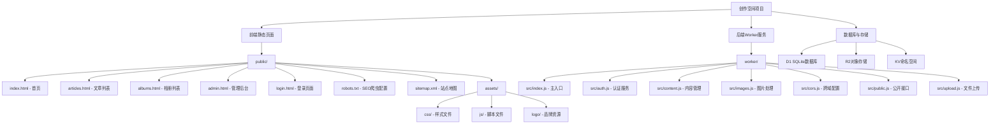

# 创作空间项目记忆库 (Memory Bank)

## 项目概述

**项目名称**: 创作空间 (Creative Space)  
**项目类型**: 内容创作与分享平台  
**目标用户**: 内容创作者、摄影师、写作者、艺术爱好者  
**核心功能**: 文章发布、相册展示、内容管理、用户认证  
**部署地址**: https://wengguodong.com  
**后端服务**: Cloudflare Workers + D1数据库 + R2存储

## 项目结构



## 技术栈

### 前端技术
- **HTML5**: 语义化标签，SEO优化
- **CSS3**: 响应式设计，动画效果
- **JavaScript ES6+**: 模块化开发，异步处理
- **Font Awesome**: 图标库
- **响应式设计**: 移动端优先

### 后端技术
- **Cloudflare Workers**: 边缘计算平台
- **D1数据库**: SQLite数据库服务
- **R2存储**: 对象存储服务
- **KV存储**: 键值对存储
- **bcryptjs**: 密码加密

### 部署与运维
- **GitHub Pages**: 静态页面托管
- **Cloudflare**: CDN加速，域名解析
- **Wrangler**: Worker部署工具

## 代码特点与规范

### 命名规范
- **HTML**: 语义化标签，中文内容
- **CSS**: 模块化命名，BEM方法论
- **JavaScript**: camelCase命名，ES6+语法
- **文件命名**: 英文命名，描述性命名

### 架构模式
- **前后端分离**: 静态页面 + API接口
- **模块化设计**: 功能模块独立，职责清晰
- **RESTful API**: 标准HTTP接口设计
- **响应式架构**: 支持多种设备访问

### 设计决策
- **SEO优先**: 完整的meta标签，结构化数据
- **用户体验**: 加载动画，响应式交互
- **安全性**: JWT认证，密码加密
- **性能优化**: 静态资源优化，懒加载

## 重要依赖与配置

### 前端依赖
```json
{
  "font-awesome": "6.0.0",
  "cdnjs": "CDN资源"
}
```

### 后端依赖
```json
{
  "bcryptjs": "^2.4.3"
}
```

### 环境配置
- **API_BASE**: Worker服务地址
- **ALLOWED_ORIGINS**: 允许的跨域来源
- **数据库绑定**: D1和R2服务绑定

## 核心功能模块

### 1. 用户认证系统
- JWT令牌管理
- 登录/登出功能
- 权限控制

### 2. 内容管理系统
- 文章CRUD操作
- 相册CRUD操作
- 分类管理

### 3. 图片处理系统
- 图片上传
- 缩略图生成
- 存储管理

### 4. SEO优化系统
- Meta标签管理
- 结构化数据
- 站点地图

## 更新日志

### 2024-12-19
- **重大更新**: 全面SEO优化
- **新增功能**: 
  - 完整的meta标签系统
  - Open Graph和Twitter Card支持
  - 结构化数据实现
  - robots.txt和sitemap.xml
  - 动态SEO更新功能
- **技术改进**: 
  - SEO配置文件系统
  - 动态标题和描述更新
  - 分类SEO优化

### 2024-12-19 (域名更新)
- **重要更新**: 域名从 lensliar.github.io 更改为 wengguodong.com
- **更新内容**:
  - 所有HTML文件中的meta标签URL
  - JavaScript文件中的canonical URL
  - SEO配置文件中的域名引用
  - 站点地图和robots.txt中的域名
  - 项目记忆库中的部署地址

### 项目初始化
- 创建基础项目结构
- 实现用户认证系统
- 建立内容管理功能
- 部署到Cloudflare平台

## 开发规范

### 代码提交规范
- 使用中文注释
- 功能模块化
- 错误处理完善
- 性能优化考虑

### 文件组织规范
- 静态资源分类存放
- 脚本文件按功能分组
- 样式文件模块化管理
- 配置文件集中管理

### 部署规范
- 前端静态资源部署到GitHub Pages
- 后端Worker部署到Cloudflare
- 数据库和存储服务配置
- 域名和CDN配置
